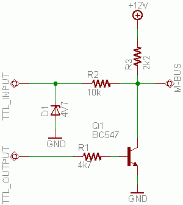
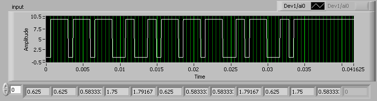

## The M-Bus Protocol

(Large portions of the following are taken from
[Joerg Hohensohn](https://web.archive.org/web/20220301142108/http://www.hohensohn.info/mbus/)
and [Hone Heke](https://web.archive.org/web/20120318034806/http://kiora.ath.cx/alpine),
though I think I might be the only one who tried to get any information out
of the cassette-tape attachment.)

### Electrical layer

The Alpine M-Bus protocol is kind of unusual. The bus is one wire, with
half-duplex transmission. The bus idles high, at +10V. Each side has
resistors (about 1800&Omega;) and can drive the bus low with open-collector
outputs. I'm using a circuit pulled from Joerg Hohenson's webpage to
interface it with my microcontroller. (Q1 can be any NPN transistor, but D1
must be a zener diode-- however, in my implementation I'm using a 5.1V one
because that's the closest that my local Radio Shack carried.)



### Link layer

To send a bit, the sender holds the bus low for ~0.6ms (for a logical
'0') or ~1.8ms (for a logical '1') then brings it back high. An entire bit
is ~3.0ms long.

Bits are grouped into packets, and every packet is some multiple of four
bits in length. The most significant bit of each nibble is transmitted
first. A packet ends when the line stays high for 3.0ms (the length of one
bit) after the last bit has been sent.

The first nibble denotes the sender. '1' (`0b0001`) is the head unit.
Apparently CD changers use '9' (`0b0100`). (I wonder if the tape player
accessory uses a different code, but I don't have one to check with.)

The last nibble denotes the checksum, which is computed by xor'ing all of
the nibbles in the packet together (excluding the checksum) and adding 1
(which may cause wrapping).

Here's what an example packet looks like directly from the stereo, seen through
the eyes of an [NI USB-6009](http://sine.ni.com/nips/cds/view/p/lang/en/nid/14605)
(which is a terrible substitute for an oscilloscope but it's what I have):



This packet is `0b0001 1000 1010`, which is the 'ping' packet
that the headunit sends every two seconds.

### Packets

(The CD Player information in this section is ripped directly from Joerg's spreadsheet.)

#### Headunit to CD player communication

##### 0x111... Set Play State

```
| Src     | Cmd     | Cmd     | Flag1   | Flag0   | ChkSum  |
| ------- | ------- | ------- | ------- | ------- | ------- |
|    1    |    1    |    1    |    ?    |    ?    |    ?    |
| 0 0 0 1 | 0 0 0 1 | 0 0 0 1 | ? ? ? ? | ? ? ? ? | ? ? ? ? |
```

- `Flag0[0]` = play
- `Flag0[1]` = pause
- `Flag0[2]` = fast forward (together with play or pause)
- `Flag0[3]` = fast reverse (together with play or pause)
- `Flag1[0]` = scan stop (together with stop)
- `Flag1[1]` = unused (0)
- `Flag1[2]` = stop
- `Flag1[3]` = resume (together with play or pause)

##### 0x113... Set Disc and Track

```
| Src     | Cmd     | Cmd     | Disc    | TrackH  | TrackL  | Flags1  | Flags0  | ChkSum  |
| ------- | ------- | ------- | ------- | ------- | ------- | ------- | ------- | ------- |
|    1    |    1    |    3    |    ?    |    ?    |    ?    |    ?    |    ?    |    ?    |
| 0 0 0 1 | 0 0 0 1 | 0 0 1 1 | ? ? ? ? | ? ? ? ? | ? ? ? ? | ? ? ? ? | ? ? ? ? | ? ? ? ? |
```

- `Disc` = Binary-coded digit
    - `0` = current disc</li>
    - `1`..`6` = change to disc 1..6
- `TrackH,L` = BCD encoded track number.
    - (`A`,`3`) = next random
    - (`B`,`3`) = prev random
    - (`0`..`9`,`0`..`9`) = go to track 0..99
- `Flag0[2]` = random
- `Flag1[0]` = play
- `Flag1[1]` = pause

##### 0x114... Set Program Mode

```
| Src     | Cmd     | Cmd     | Flags1  | Flags0  | ?       | ?       | ?       | ChkSum  |
| ------- | ------- | ------- | ------- | ------- | ------- | ------- | ------- | ------- |
|    1    |    1    |    4    |    ?    |    ?    |    0    |    0    |    0    |    ?    |
| 0 0 0 1 | 0 0 0 1 | 0 1 0 0 | ? ? ? ? | ? ? ? ? | 0 0 0 0 | 0 0 0 0 | 0 0 0 0 | ? ? ? ? |
```

- `Flag0[1]` = random
- `Flag0[3]` = intro scan
- `Flag1[2]` = repeat one
- `Flag1[3]` = repeat all

##### 0x18... Ping

```
| Src     | Cmd     | ChkSum  |
| ------- | ------- | ------- |
|    1    |    8    |    A    |
| 0 0 0 1 | 1 0 0 0 | 1 0 1 0 |
```

Sent periodically (every two seconds) from the headunit to keep the connection alive.

##### 0x19... Powerup

```
| Src     | Cmd     | ChkSum  |
| ------- | ------- | ------- |
|    1    |    9    |    8    |
| 0 0 0 1 | 1 0 0 1 | 1 0 0 0 |
```

#### CD Player to Headunit communication

##### 0x98... Ping OK

```
| Src     | Cmd     | ChkSum  |
| ------- | ------- | ------- |
|    9    |    8    |    1    |
| 1 0 0 1 | 1 0 0 0 | 0 0 0 1 |
```

Sent in response to a 0x18A 'ping' message.

##### 0x99... Play State

```
| Src     | Cmd     | State   | TrackH  | TrackL  | IndexH  | IndexL  | MinH    | MinL    | SecH    | SecL    | Flags2  | Flags1  | ?       | Flags0  | ChkSum  |
| ------- | ------- | ------- | ------- | ------- | ------- | ------- | ------- | ------- | ------- | ------- | ------- | ------- | ------- | ------- | ------- |
|    9    |    9    |    ?    |    ?    |    ?    |    ?    |    ?    |    ?    |    ?    |    ?    |    ?    |    ?    |    ?    |    0    |    ?    |    ?    |
| 1 0 0 1 | 1 0 0 1 | ? ? ? ? | ? ? ? ? | ? ? ? ? | ? ? ? ? | ? ? ? ? | ? ? ? ? | ? ? ? ? | ? ? ? ? | ? ? ? ? | ? ? ? ? | ? ? ? ? | 0 0 0 0 | ? ? ? ? | ? ? ? ? |
```

- `State` = `1`..`7`:
    - `1` = preparing
    - `2` = stopped
    - `3` = paused
    - `4` = playing
    - `5` = spinup (accompanied by doot, doot, doot tones)
    - `6` = fast forward (accompanied by doot-dootdoot-doot tones)
    - `7` = fast reverse (accompanied by same tones)</ul>
- `TrackH,L` = BCD digits, `0`..`F` (my headunit displays `a` through `f`)
- `IndexH,L` = BCD digits, `0`..`F`
- `MinH,L` = BCD digits, `0`..`9`
- `SecH,L` = BCD digits, `0`..`9`
- `Flags0[0]` = play
- `Flags0[1]` = paused
- `Flags0[3]` = stopped
- `Flags1[1]` = random
- `Flags1[3]` = intro scan
- `Flags2[2]` = repeat one
- `Flags2[3]` = repeat all

##### 0x9A... Power up?

```
| Src     | Cmd     | ?       | ?       | ?       | ?       | ?       | ?       | ?       | ?       | ?       | ?       | ChkSum  |
| ------- | ------- | ------- | ------- | ------- | ------- | ------- | ------- | ------- | ------- | ------- | ------- | ------- |
|    9    |    A    |    0    |    0    |    0    |    0    |    0    |    0    |    0    |    0    |    0    |    0    |    3    |
| 1 0 0 1 | 1 0 1 0 | 0 0 0 0 | 0 0 0 0 | 0 0 0 0 | 0 0 0 0 | 0 0 0 0 | 0 0 0 0 | 0 0 0 0 | 0 0 0 0 | 0 0 0 0 | 0 0 0 0 | 0 0 1 1 |
```

##### 0x9B... Last Play Info/Changing

```
| Src     | Cmd     | Phase   | Disc    | TrackH  | TrackL  | Flags3  | Flags2  | Flags1  | ?       | Flags0  | ChkSum  |
| ------- | ------- | ------- | ------- | ------- | ------- | ------- | ------- | ------- | ------- | ------- | ------- |
|    9    |    B    |    ?    |    ?    |    ?    |    ?    |    ?    |    ?    |    ?    |    0    |    ?    |    ?    |
| 1 0 0 1 | 1 0 1 1 | ? ? ? ? | ? ? ? ? | ? ? ? ? | ? ? ? ? | ? ? ? ? | ? ? ? ? | ? ? ? ? | 0 0 0 0 | ? ? ? ? | ? ? ? ? |
```

- `Phase` = `0`,`8`..`D`
    - `0` = Last Played Info
    - `4` = causes disc/track number to flash
    - `9` = with done flag, indicates end of changing
    - `A` = No magazine (displays blinking '---')
    - rest unknown
- `Disc`
    - `0x0`..`9` = appropriate digit
    - `0xA` = blank
    - `0xB` = ? Same as 0xC except center segment is on as well.
    - `0xC` = 'Q'? Top, top-right, bottom-right, bottom, and center-bottom-right segments are on.
    - `0xD` = 'H'
    - `0xE` = 'L'
    - `0xF` = 'P'
- `TrackH,L` = BCD digits, 0 when Phase is not 0 or 9.
- `Flags0[0]` = done
- `Flags1[1]` = random
- `Flags2[2]` = repeat one
- `Flags2[3]` = repeat all
- `Flags3[0]` = busy
- `Flags3[3]` = eject

##### 0x9C... Disc info

```
| Src     | Cmd     | Disc    | ?       | ?       | TrackH  | TrackL  | MinH    | MinL    | SecH    | SecL    | Flags   | ChkSum  |
| ------- | ------- | ------- | ------- | ------- | ------- | ------- | ------- | ------- | ------- | ------- | ------- | ------- |
|    9    |    C    |    ?    |    0    |    1    |    ?    |    ?    |    ?    |    ?    |    ?    |    ?    |    ?    |    ?    |
| 1 0 0 1 | 1 1 0 0 | ? ? ? ? | 0 0 0 0 | 0 0 0 1 | ? ? ? ? | ? ? ? ? | ? ? ? ? | ? ? ? ? | ? ? ? ? | ? ? ? ? | ? ? ? ? | ? ? ? ? |
```

- `Disc` = BCD, `1`..`6`
- `TrackH,L` = BCD, `0`..`9`
- `MinH,L` = BCD, `0`..`9`
- `SecH,L` = BCD, `0`..`9`
- `Flags` = unknown.

##### 0x9D... Status info?

```
| Src     | Cmd     | ?       | ?       | ?       | Flags4  | Flags3  | Flags2  | Flags1  | Flags0  | ChkSum  |
| ------- | ------- | ------- | ------- | ------- | ------- | ------- | ------- | ------- | ------- | ------- |
|    9    |    D    |    0    |    0    |    0    |    ?    |    ?    |    ?    |    ?    |    ?    |    ?    |
| 1 0 0 1 | 1 1 0 1 | 0 0 0 0 | 0 0 0 0 | 0 0 0 0 | ? ? ? ? | ? ? ? ? | ? ? ? ? | ? ? ? ? | ? ? ? ? | ? ? ? ? |
```

Meaning of everything unknown.

##### 0x9E... More status info?

```
| Src     | Cmd     | ?       | ?       | ?       | ?       | ?       | ?       | ?       | ChkSum  |
| ------- | ------- | ------- | ------- | ------- | ------- | ------- | ------- | ------- | ------- |
|    9    |    E    |    0    |    0    |    0    |    0    |    0    |    0    |    0    |    ?    |
| 1 0 0 1 | 1 1 1 0 | 0 0 0 0 | 0 0 0 0 | 0 0 0 0 | 0 0 0 0 | 0 0 0 0 | 0 0 0 0 | 0 0 0 0 | ? ? ? ? |
```

##### 0x9F... Acknowledge/Wait

```
| Src     | Cmd     | Err1    | Err0    | ?       | ?       | Flags   | ChkSum  |
| ------- | ------- | ------- | ------- | ------- | ------- | ------- | ------- |
|    9    |    F    |    ?    |    ?    |    0    |    0    |    ?    |    ?    |
| 1 0 0 1 | 1 1 1 1 | ? ? ? ? | ? ? ? ? | 0 0 0 0 | 0 0 0 0 | ? ? ? ? | ? ? ? ? |
```

- `Err0[0]` = disc change malfunction (`E-01` displayed)
- `Err0[1]` = disc in player malfunction (`E-02` displayed)
- `Err1` = when 3, high temperature error (`---H` displayed), else when >=1 input is muted
- `Flags` = Meaning unknown. `0b0000`, `0b0001`, `0b0110`, `0b0111`, `0b1001` seen, differences are unknown.

#### Headunit to Tape Player communication

##### 0x32... Ping

```
| Src     | Cmd     | ChkSum  |
| ------- | ------- | ------- |
|    3    |    2    |    2    |
| 0 0 1 1 | 0 0 1 0 | 0 0 1 0 |
```

Probe message for tape player. Tape player responds with `0xB2A`.

##### 0x33... Set State

```
| Src     | Cmd     | Flags1  | Flags0  | ChkSum  |
| ------- | ------- | ------- | ------- | ------- |
|    3    |    3    |    ?    |    ?    |    ?    |
| 0 0 1 1 | 0 0 1 1 | ? ? ? ? | ? ? ? ? | ? ? ? ? |
```

- `Flags1[2]` = NR on or off
- All other flags unknown.

#### Tape Player to Headunit communication

##### 0xB1... Current State

```
| Src     | Cmd     | Flags3  | Flags2  | Flags1  | Flags0  | ChkSum  |
| ------- | ------- | ------- | ------- | ------- | ------- | ------- |
|    B    |    1    |    ?    |    ?    |    ?    |    ?    |    ?    |
| 1 0 1 1 | 0 0 0 1 | ? ? ? ? | ? ? ? ? | ? ? ? ? | ? ? ? ? | ? ? ? ? |
```

- `Flags2[2]` = NR on or off
- All other flags unknown.

##### 0xB2... Ping OK

```
| Src     | Cmd     | ChkSum  |
| ------- | ------- | ------- |
|    B    |    2    |    2    |
| 1 0 1 1 | 0 0 1 0 | 0 0 1 0 |
```

Response to `0x322`.
