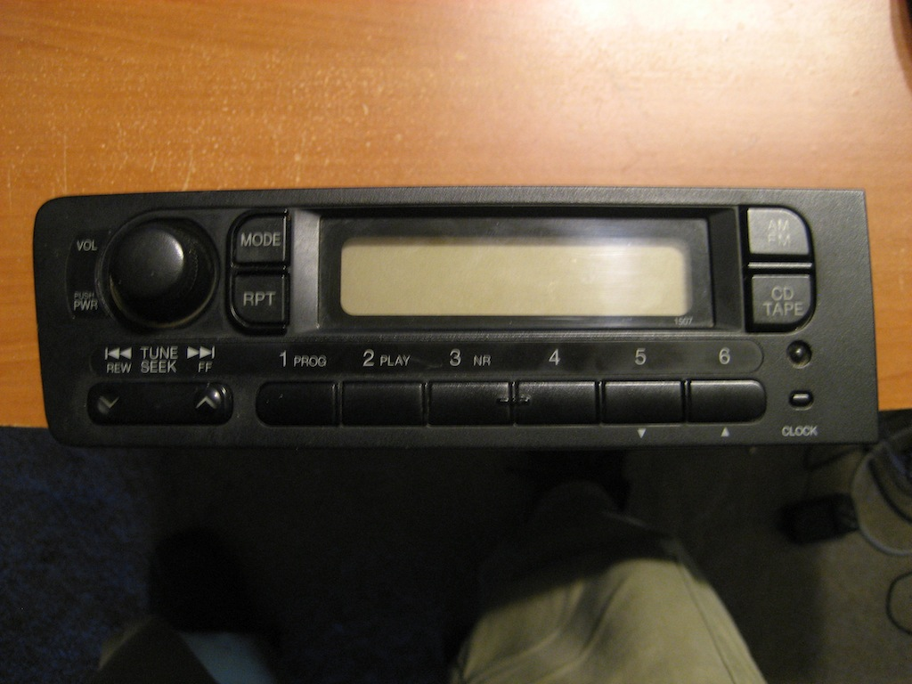
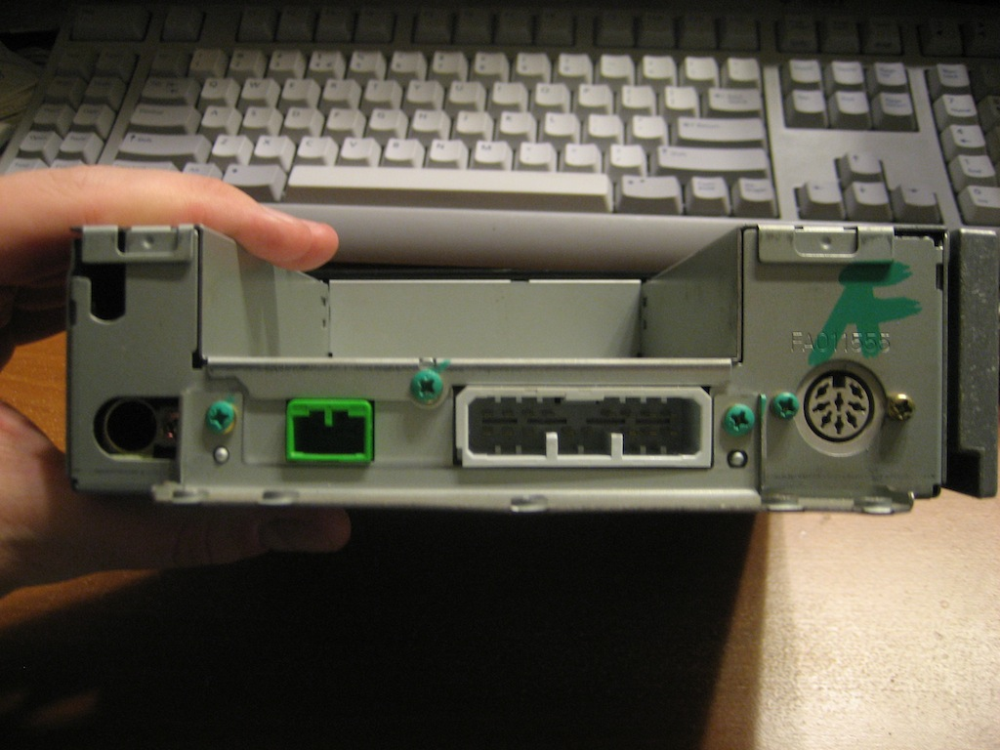
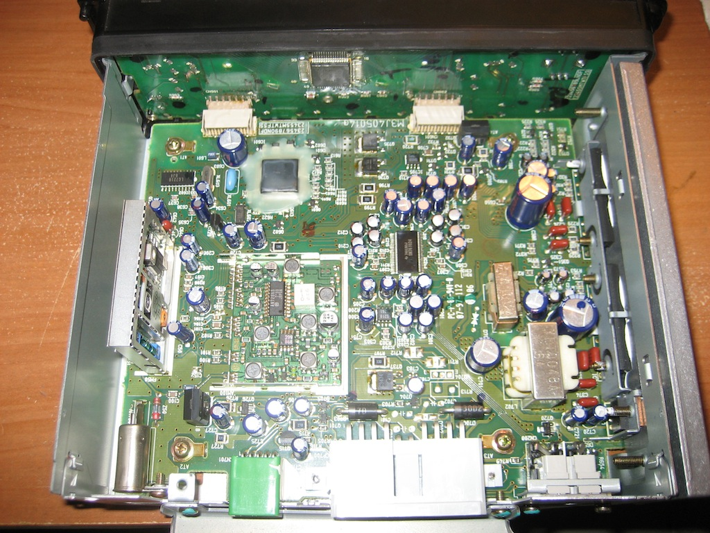
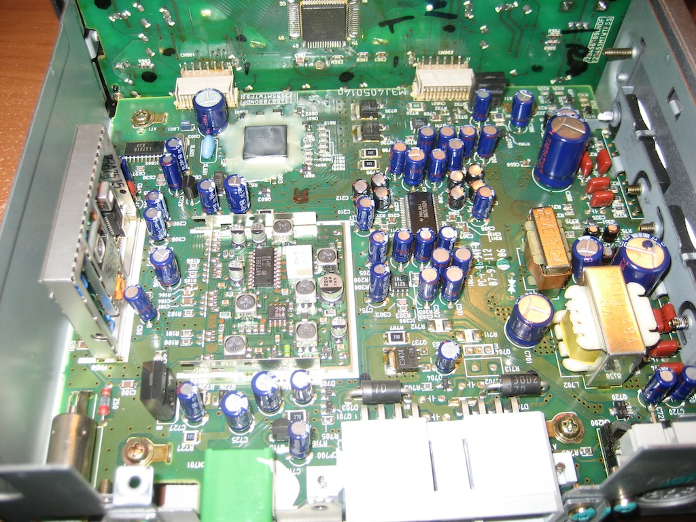
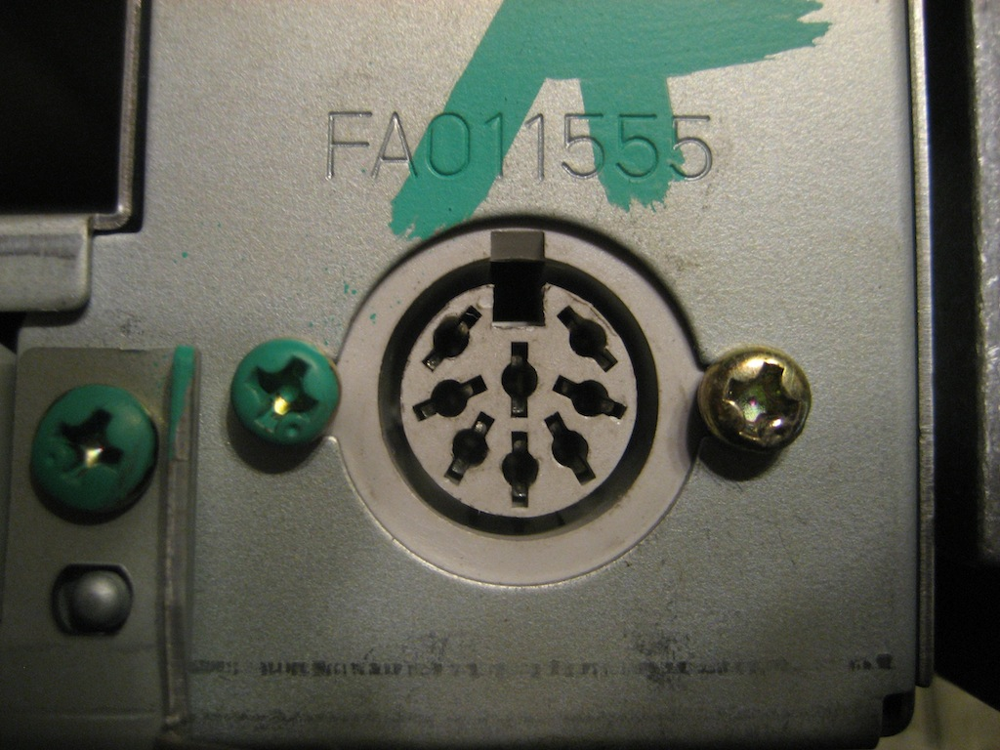
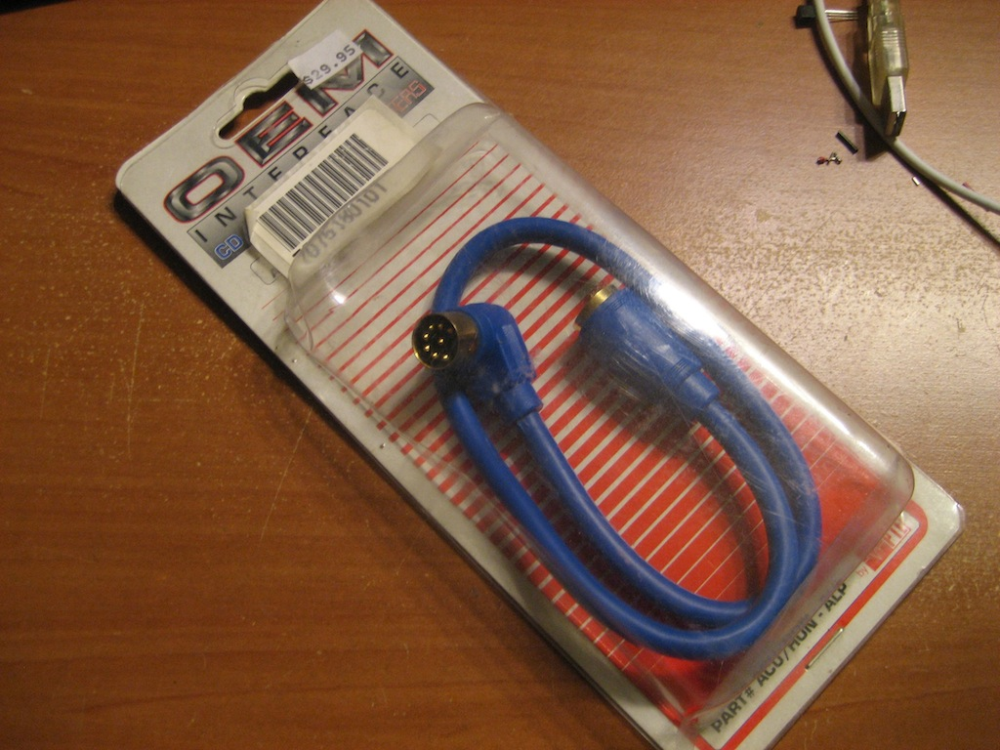
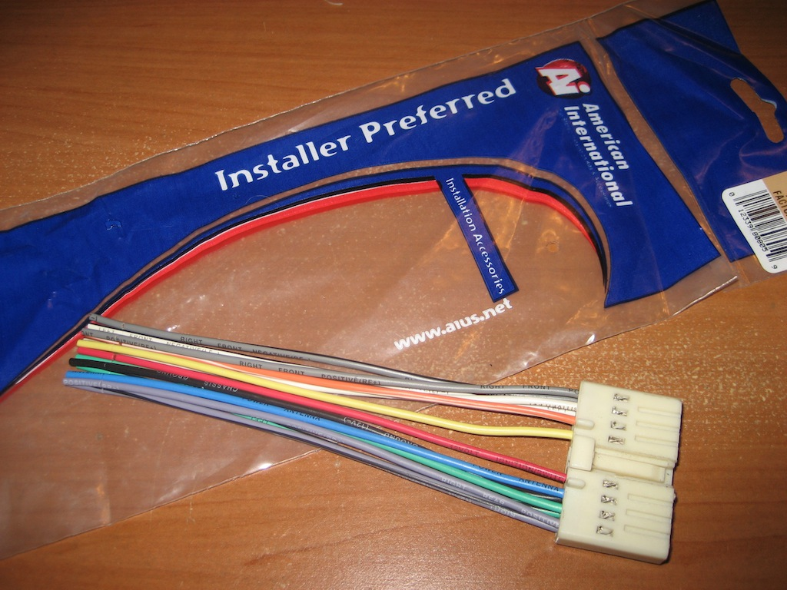
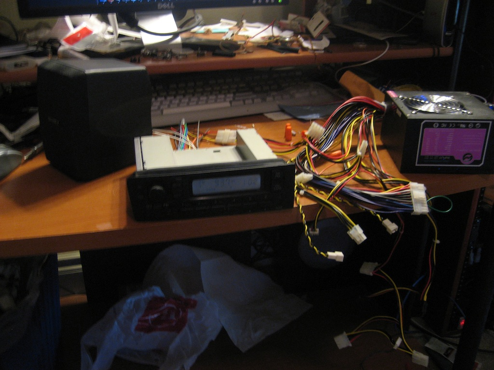
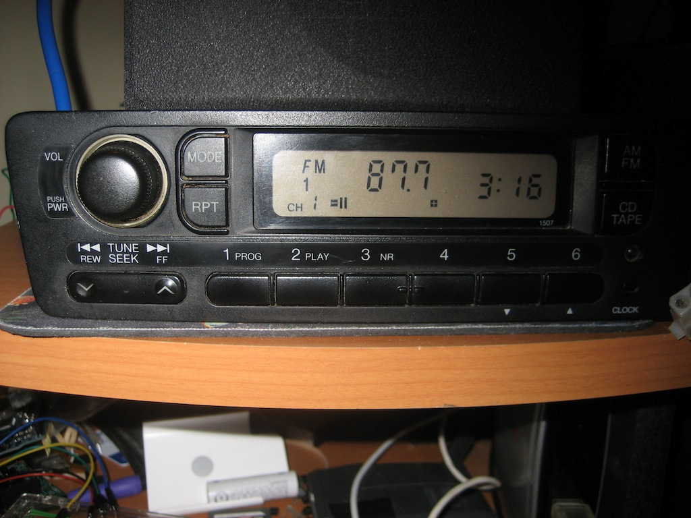

## The Stock Civic Headunit

I figured I should get some information in on the stock headunit for a 1996 Honda Civic (and 1997 and 1998),
since I couldn't find a whole lot about it, aside from it using [Alpine M-Bus](/mbus.md).

I believe that the 99-00 radio is similar, though it uses a different accessory connector. I don't
know what the pinout of it is.

Here's the front of the radio. Nothing too unusual; volume/power knob, seek controls, 6 preset/disc buttons.

And here's the back. The connectors, from left to right: Antenna, keyless entry, car harness, aux (M-Bus) connector.
Yes, keyless entry runs through the stereo. I've seen some stuff that says if you wanted to put in an aftermarket
stereo and you wanted keyless entry, you had to do things like wire up both stereos and hide the stock
one somewhere. Ew. Thanks, Honda! (This was apparently fixed in the 1999 model.)
I don't have power locks, so keyless entry wouldn't work for me anyway.

Also, the weird notch thing is for the stock security system; the module for it fits in there.

A couple pictures of inside the radio. Maybe someone understands it. I don't.

The aux connector. Looks like a standard 8-pin circular DIN connector? Look closely; the top two pins aren't in the 'circle';
they're offset slightly. Not only that, but [two of the pins are reversed](https://web.archive.org/web/20100102044209/http://nsxprime.com/FAQ/DIY/sound_system.htm)
from the standard Alpine connector (which is a standard 8-pin DIN), in an attempt to make you more inclined to purchase a Honda-branded
CD changer. Thanks again, Honda! (If you want to find a plug for it, the only one I've found that looks close is a 
[Switchcraft 20GM8M](https://web.archive.org/web/20100421165410/http://www.switchcraft.com/products/connectors-36.html), which you have to special-order.)

(TODO: diagram this out with the pinout.)

Fortunately, people at one point made products to connect OEMed Alpine gear to retail Alpine gear, such as the
[PIE ACU/HON-ALP](http://www.amazon.com/gp/product/B0015G4PFE); it adapts it to a real 8-pin DIN connection, and
also swaps the two reversed pins back.

When you install an aftermarket stereo, you can use an adaptor cable to connect between your car's stereo wiring to the cable
that comes with your aftermarket stereo. The previous owner of my car didn't take this approach, instead using the (more common)
cut-off-the-old-connector-and-splice-the-new-one-on approach, so I had to buy [a new OEM wiring harness](http://www.amazon.com/gp/product/B000KL4YY2).

Because I don't really want to be doing microcontroller programming in my car, I needed some way to wire this up. As it turns out,
an ATX power supply is a perfect way to power a car stereo. I used wire nuts to connect the 12V constant line (red on my harness) and
12V battery (yellow on my harness) lines to 12V (yellow) on a female ATX Molex connector, and ground to ground (both black). Add a jumper
wire to the motherboard connector to jump pin 16 (power on) to pin 15 (ground).

I also added a random speaker that I found, so I could make sure things worked. I don't offhand know how high I can drive it, so I just
keep the volume low.

A closeup of the LCD. Again, nothing too fancy; it has displays for a radio station/track number, time,
channel/disc number, volume, etc. Sadly, no text controls for letting me output track titles. That'd be sweet.

